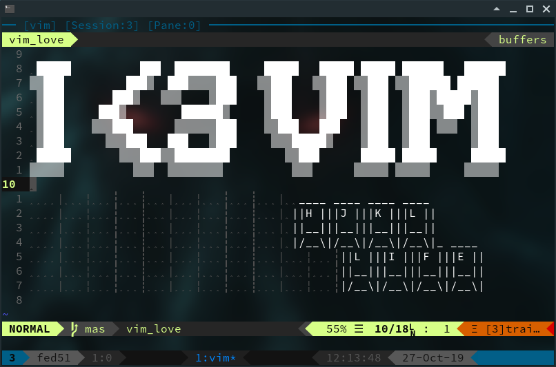

# VIM Cheat Sheet

## For New VIM Enthusiasts

This cheat sheet assumes that the reader alreading has a basic understanding of how to open, edit, save, and exit, VIM.

This guide is a work-in-progress and I will be adding to it over time.

## Table of Contents

1. [VIM Basic For New Users](#vim-basic-for-new-users)
   1. [Modes](#modes)
   1. [Saving and Exiting](#saving-and-exiting)
1. [.vimrc Magic](#vimrc-magic)
1. [Buffers](#buffers)
   1. [Basics](#basics)
   1. [Delete Buffers](#delete-buffers)
   1. [Delete Other Buffers](#delete-other-buffers)

### VIM Basic For New Users

#### Modes

***Normal/Command Mode***

This the default mode when opening Vim. Vim keyboard commands can be used in this mode to perform various tasks.

You can return to **Normal** mode from other modes simple by pressing the **ESC** key.

***Command Line Mode***

Whenever you see instructions that supply a Vim comment that starts with **:** the you are working with a command line mode function.

Simply pressing **:** will enter you into *Command Line* mode, and information enter after it is the commant.

***Insert Mode***

This mode is where files are modified.

To enter **Insert Mode** press **i** or **Insert**.

***Visual Mode***

This mode enables the ability to select lines and blocks of text.

This mode is entered by pressing **v** for *Visual Mode* or **ctrl-v** to enter **Visual-Block Mode**.

#### Saving and Exiting

***Saving***

Command | Function
------------------
:w		|Save
:wq / :x|Save and close file
ZZ		|Save and quit

***Exiting***

Command | Function
--------|---------
:qa		|Close all files
:qa!	|Close all files, abandon changes
:q		|Close file
:q!		|Close file, abandon changes
ZQ		|		Quit without checking changes

### Buffers

#### Basics

***List all open buffers***

Use the following command to list all buffers.

`:buffers`

Example Output of `:buffers`:

    1 #a   "MyFile.txt"                   line 5
    3 %a   "Some_Other_File.txt"          line 1
    4 #  + "~/.vimrc"                     line 28
    5  a   "~/plain_text_passwords.lol"   line 7

* Column 1
  * Buffer number.
* Column 2
  * The current buffer is marked by `%`.
  * An alternate buffer will be marked with `#`.
  * Active buffers, or buffers that are displayed on screen, will be marked with an `a`.
* Column 3
  * This column will display a `+` if there are any unwritten changes in that buffer.
* Column 4
  * Filename.
* Column 5
  * Line number where the cursor is located in that buffer.

#### Delete Buffers

***Delete Current Buffer***

You will not want to use `:q` when working with multiple files as it will exit VIM entirely.

Instead, you can manage buffers with a couple of commands.

Delete Current buffer:

`:bdelete`

or:

`:bd`

#### Delete Other Buffers

***Deleting a Single Buffer***

Enter the `:bd` command and the buffer number of the buffer to be deleted.
Alternative, start typing the name of the file in the target buffer and use tab completion to finish the filename.

`:bd [<buffer number>|<file.name>]`

**Deleting Multiple Buffers**

To delete multiple buffers at once, append an "!" to the end of the `:bd` command:

`:bd! <buffer 1> <buffer 2> ...`

### Advanced

#### .vimrc Magic

***Change Detection***

Check if file has been changed externally and reload into buffer:

`au FocusGained,BufEnter * :silent! checktime`

***Auto-Save***

Auto-save on window focus is lost:

`au FocusLost,WinLeave * :silent! w`

***Mouse Functionality***

Enable mouse interactivity:

`set mouse=a`

The mouse can be enabled for different modes:

Value|description
-----|------------
n    |Normal mode and Terminal modes
v    |Visual mode
i    |Insert mode
c    |Command-line mode
h    |all previous modes when editing a help file
a    |all previous modes
r    |for hit-enter and more-prompt prompt

***Pane Size Constraint***

Automatically resize panes proportionately when terminal window size changes:

`au VimResized * wincmd =`
